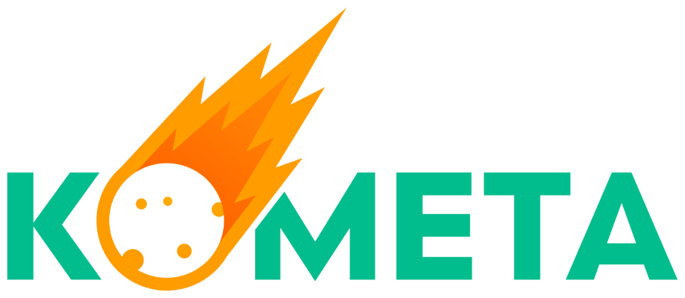
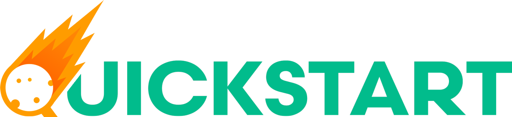
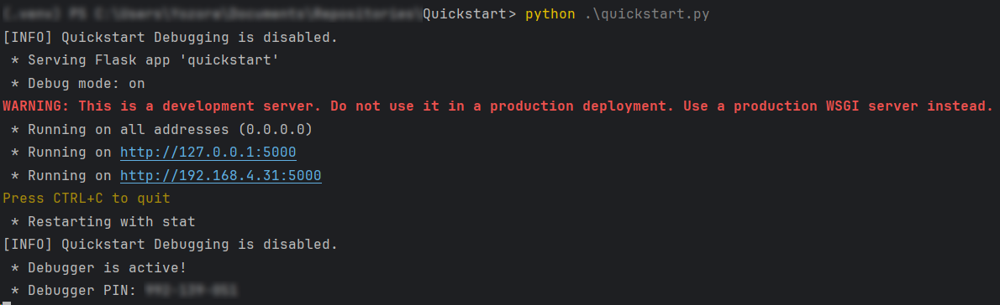

### WIP - Not Fully Functional





Welcome to the Kometa Quickstart. Let's get started.

** We recommend you run this yourself and not from someone else hosting quickstart as it will make connection attempts to services and machines available to you and only you. Additionally, the credentials used are stored locally and you would not want to store your information on someone else's machine.**

After having cloned the repo and assuming you are on Windows and you have a folder on your machine called `pyprogs` where you cloned Quickstart, open a powershell prompt into the `pyprogs` folder and then:

```
cd Quickstart
python -m venv venv
.\venv\scripts\activate.ps1
python -m pip install --upgrade pip
pip install -r .\requirements.txt
pre-commit install
pre-commit autoupdate
```
Now you are ready to run it (with the venv activated)

`python quickstart.py`

Or how to call it to run from the venv if you have closed the powershell prompt. Navigating to `pyprogs\Quickstart`

`.\venv\scripts\python quickstart.py`

Which will look like this and then open up your favorite browser and navigate to the listed URLs:


Note: Updates can then be performed pretty easily by opening up your Windows powershell prompt into the `pyprogs` directory and performing the following commands:
```
cd Quickstart
git checkout main
git stash
git stash clear
git pull
.\venv\scripts\activate.ps1
python -m pip install --upgrade pip
pip install -r .\requirements.txt
pre-commit autoupdate
```

There is a `.envrc` in the project, so if you are using a linux-alike and install `direnv`, then just entering the project directory in your shell will do all the above for you and leave you ready to run `python quickstart.py`.
