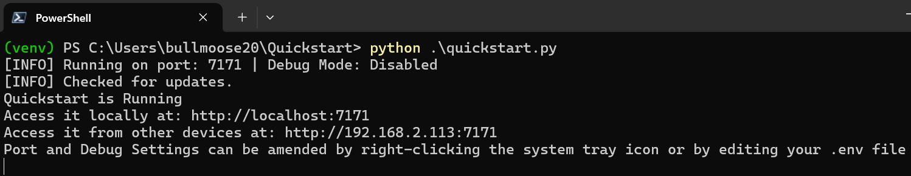

[](https://github.com/Kometa-Team/Quickstart/releases)
[](https://hub.docker.com/r/kometateam/quickstart)
[](https://hub.docker.com/r/kometateam/quickstart)
[](https://github.com/Kometa-Team/Quickstart/tree/develop)

[](https://discord.gg/NfH6mGFuAB)
[](https://www.reddit.com/r/Kometa/)
[](https://kometa.wiki/en/latest/home/scripts/quickstart.html)
[](https://github.com/sponsors/meisnate12)
[](https://github.com/sponsors/meisnate12)

Welcome to Kometa Quickstart! This Web UI tool will guide you through creating a Configuration File to use with Kometa.

Special Thanks to [bullmoose20](https://github.com/bullmoose20), [chazlarson](https://github.com/chazlarson) and [Yozora](https://github.com/yozoraXCII) for the time spent developing this tool.

## Prerequisites

It's ideal that you go through the Kometa install walkthrough prior to running Quickstart, as that will get Kometa set up to accept the config file that Quickstart will produce.  Running Quickstart and *then* the walkthrough could end up running into problems that will not be addressed in the walkthroughs; at best nothing in the walkthrough will match expectations so you will be left to figure out any differences yourself.

This will also familiarize you with setting up a virtual environment for running this as a Python script.

## Installing Quickstart

There are essentially 5 ways to install and run Quickstart. The order presented here is likely the simplest to the most advanced way of installing Quickstart.

> [!CAUTION]
> **We strongly recommend running this yourself rather than relying on someone else to host Quickstart.**
>
> This ensures that connection attempts are made exclusively to services and machines accessible only to you. Additionally, all credentials are stored locally, safeguarding your sensitive information from being stored on someone else's machine.
>

## 1 - Installing on Windows

- Go to the releases page to grab a single `exe` that you can run.
- https://github.com/Kometa-Team/Quickstart/releases
- Pick the build (`master` or `develop`) you are interested in and then go to the Assets section and pick the right `exe`
- Store it in its own folder and dbl-click to run
- Manage Quickstart from the system tray icon


## 2 - Installing on Mac

- Go to the releases page to grab a single `exe` that you can run.
- https://github.com/Kometa-Team/Quickstart/releases
- Pick the build (`master` or `develop`) you are interested in and then go to the Assets section and pick the right `exe`
- Store it in its own folder and dbl-click to run. You may need to allow for unsigned applications to run within the MacOS settings under Privacy
- Manage Quickstart from the system tray icon


## 3 - Installing on Ubuntu (Linux)

- Go to the releases page to grab a single `exe` that you can run.
- https://github.com/Kometa-Team/Quickstart/releases
- Pick the build (`master` or `develop`) you are interested in and then go to the Assets section and pick the right `exe`
- Store it in its own folder and modify permissions to allow it to run (chmod 755). Then dbl-click it to run.
- Manage Quickstart from the system tray icon


> [!WARNING]
> You will likely need to perform these steps first to have a system tray icon show up:
```shell
sudo apt update
sudo apt install -y libxcb-xinerama0 libxcb-xinerama0-dev libxcb-icccm4 libxcb-image0 libxcb-keysyms1 libxcb-render-util0
```

## 4 - Running in Docker

Here are some minimal examples:

### `docker run`
```
docker run -it -v "/path/to/config:/config:rw" kometateam/quickstart:develop
```

### `docker compose`
```yaml
services:
  quickstart:
    image: kometateam/quickstart:develop
    container_name: quickstart
    environment:
      - TZ=TIMEZONE #optional
    volumes:
      - /path/to/config:/config #edit this line for your setup
    restart: unless-stopped
```

## 5 - Installing on local (python and git already installed)

These are high-level steps which assume the user has knowledge of python and pip, and the general ability to troubleshoot issues.

1. Clone or download and unzip the repo.
```shell
git clone https://github.com/Kometa-Team/Quickstart
```

2. Move into the Quickstart directory.
```shell
cd Quickstart
```

3. Install dependencies (it is recommended to do this in a Python virtual environment `venv`):
```shell
pip install -r requirements.txt
```

4. If the above command fails, run the following command:
```shell
pip install -r requirements.txt --ignore-installed
```

> [!WARNING]
> If you are running the single file executable in Ubuntu Linux, you will likely need to perform these steps first to have a system tray icon show up:
```shell
sudo apt update
sudo apt install -y libxcb-xinerama0 libxcb-xinerama0-dev libxcb-icccm4 libxcb-image0 libxcb-keysyms1 libxcb-render-util0
```

At this point Quickstart has been installed, and you can verify installation by running (it is recommended to do this in a python virtual environment `venv` as shown in the image below):
```shell
python quickstart.py
```

You should see something similar to this:



Quickstart should launch a browser automatically. If you are on a headless machine (docker or linux without GUI) open a browser and navigate to the ip address of the machine Quickstart is running on and you should be taken to the Quickstart Welcome Page.

- Manage Quickstart from the system tray icon


### Debugging & Changing Ports

Users can choose to enable debugging mode which will add verbose logging to the console window.

There are three ways to enable debugging:
- Add `--debug` to your Run Command, for example: `python quickstart.py --debug`.
- Open the `.env` file at the root of the Quickstart directory, and set `QS_DEBUG=1` (restart required).
- Use the Quickstart system tray icon to toggle it on or off (no restart required).

Quickstart will run on port 7171 by default, this can be amended in one of three ways:
- Add `--port=XXXX` to your Run Command, for example: `python quickstart.py --port=1234`
- Open the `.env` file at the root of the Quickstart directory, and set `QS_PORT=XXXX` where XXXX is the port you want to run on. (restart required)
- Use the Quickstart system tray icon to choose a new port (restarts automatically).
